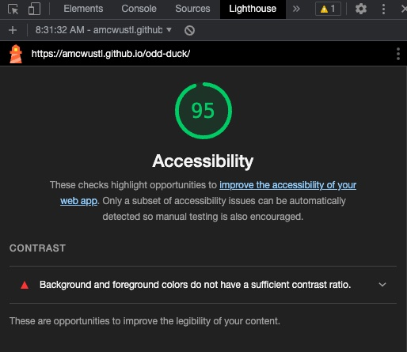
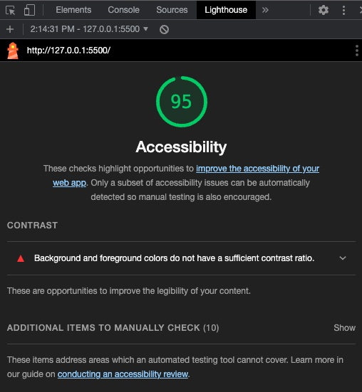
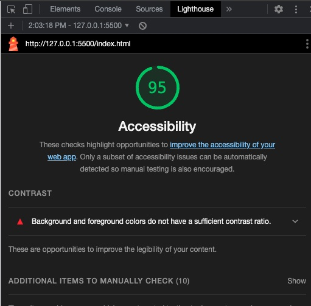

# Odd - Duck Lab

This lab takes a group of images representing new R&D products for the odd-duck manufacturing company and presents them to the user in groups of 3.  The user then selects their favorite from the group of products.  This process repeats 25 times.  Once the results are compiled, the user clicks show results and can see the results of their votes.

### Author: Aaron Clark

### Links and Resources

* Logo image sourced from: https://freesvg.org/duck-silhouette-low-poly

### Lighthouse Accessibility Report Score

* 

* 

* 
